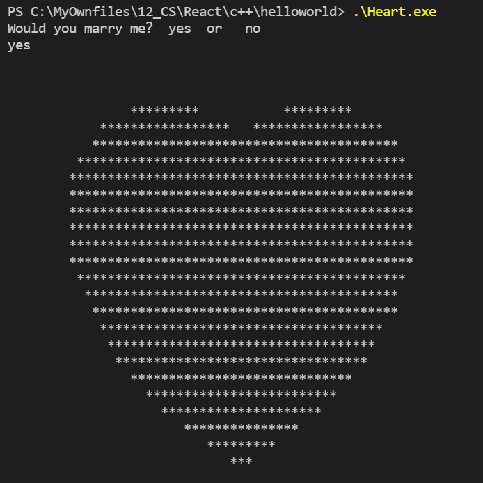
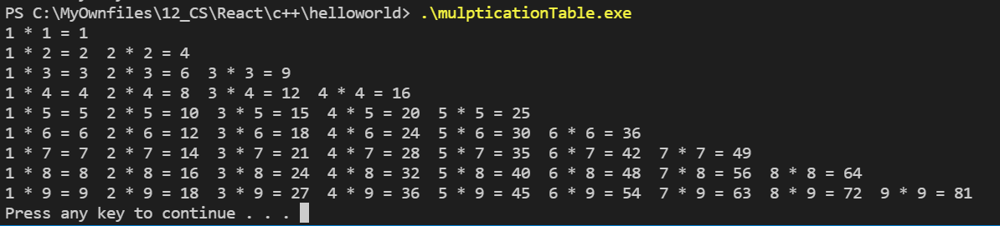
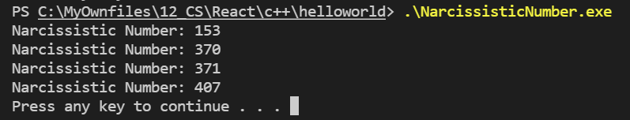

## This a c++ repository for funny programes.

### 1. Would you marry me?
After you type "yes", it will show a big heart.

### 2. Multiplication Table
This is a table used to memorize multiplication formula for primary students.

### 3. Narcissistic Number
This is Narcissistic Number between 100 and 1000.

 

